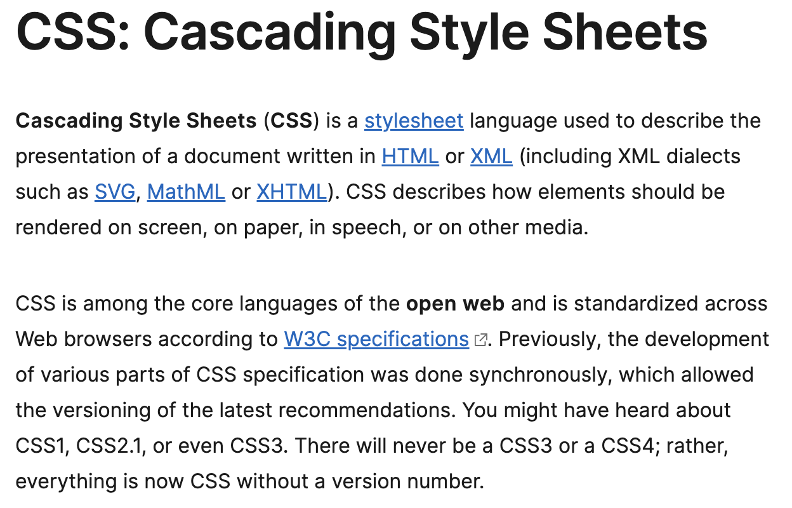
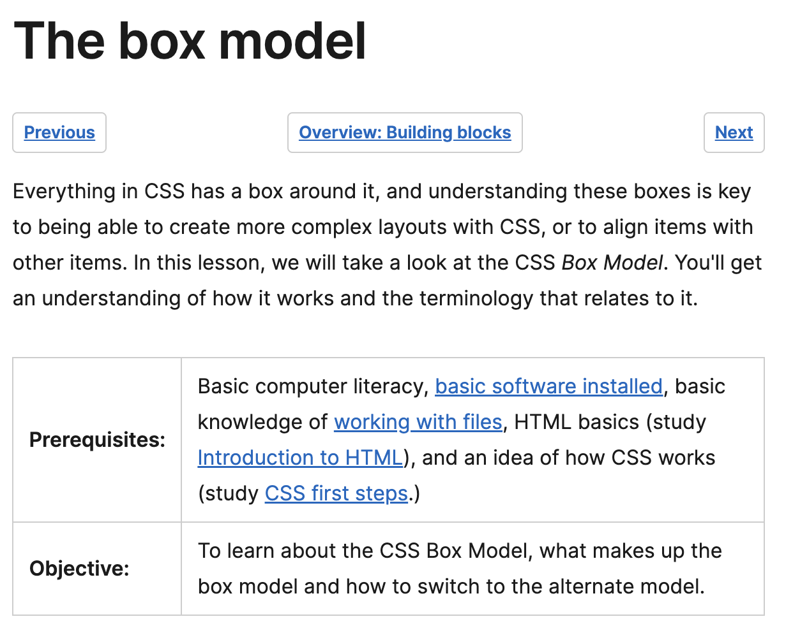
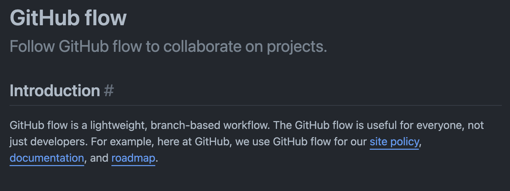
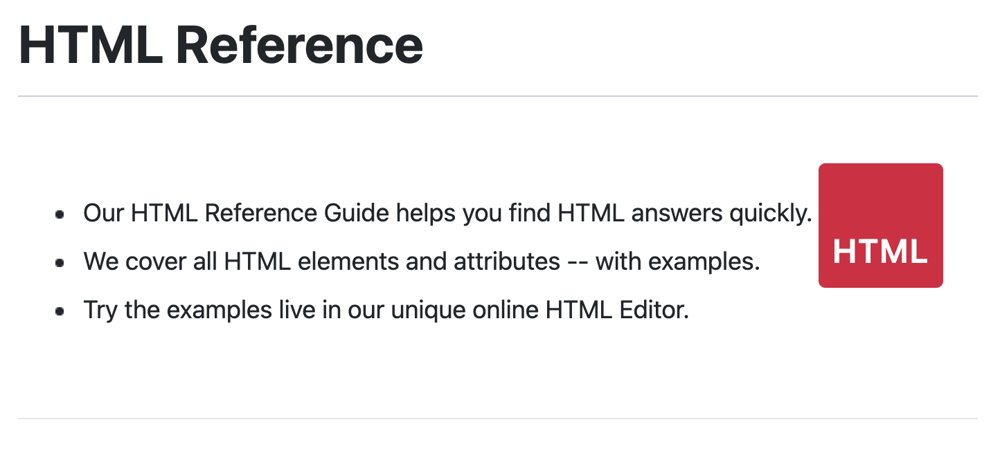
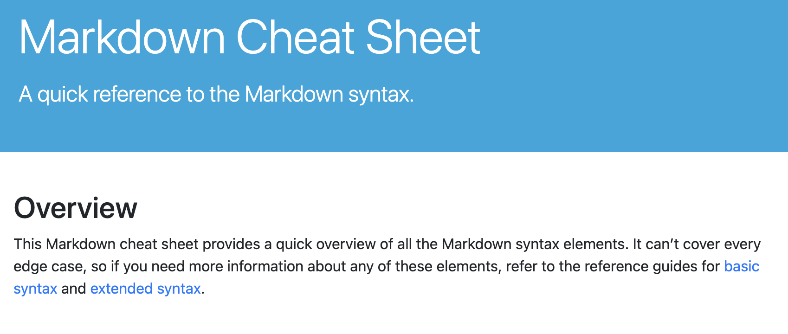

# <Module1-Challenge>

## Description

This project consisted of refactoring and using semantic code with proper comments so that the client's codebase follows accesibility standards. As well as optimizing their site for search engines. Through this project I have learned more on how to work with HTML, CSS, and Git. 

## Table of Contents
- [Website Preview](#website-preview)
- [Credits](#credits)
- [Special Thanks](#special-thanks)
- [License](#license)

## Website Preview

## Credits

### CSS Information

### CSSBox Information

### Git Cheat Sheet

### Git Flow Process

### HTML References

### Markdown Language

## Special Thanks

I want to give a special thanks to my instructors and teacher assistants for all their help. I also want to give thanks to the students who have created study groups to help one another out. 

## License

MIT License

Copyright (c) 2023 Natalie C

Permission is hereby granted, free of charge, to any person obtaining a copy
of this software and associated documentation files (the "Software"), to deal
in the Software without restriction, including without limitation the rights
to use, copy, modify, merge, publish, distribute, sublicense, and/or sell
copies of the Software, and to permit persons to whom the Software is
furnished to do so, subject to the following conditions:

The above copyright notice and this permission notice shall be included in all
copies or substantial portions of the Software.

THE SOFTWARE IS PROVIDED "AS IS", WITHOUT WARRANTY OF ANY KIND, EXPRESS OR
IMPLIED, INCLUDING BUT NOT LIMITED TO THE WARRANTIES OF MERCHANTABILITY,
FITNESS FOR A PARTICULAR PURPOSE AND NONINFRINGEMENT. IN NO EVENT SHALL THE
AUTHORS OR COPYRIGHT HOLDERS BE LIABLE FOR ANY CLAIM, DAMAGES OR OTHER
LIABILITY, WHETHER IN AN ACTION OF CONTRACT, TORT OR OTHERWISE, ARISING FROM,
OUT OF OR IN CONNECTION WITH THE SOFTWARE OR THE USE OR OTHER DEALINGS IN THE
SOFTWARE.

